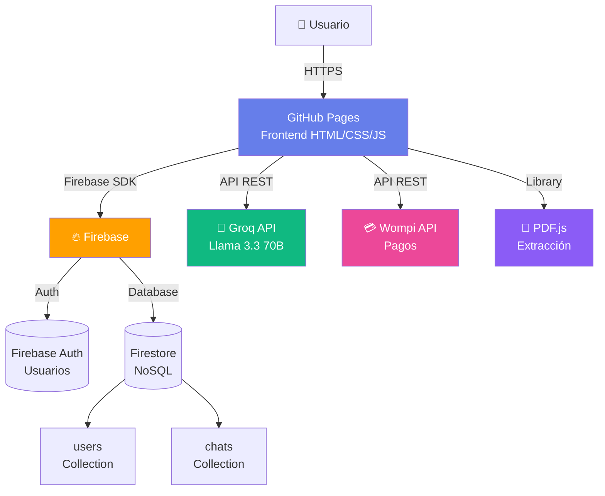
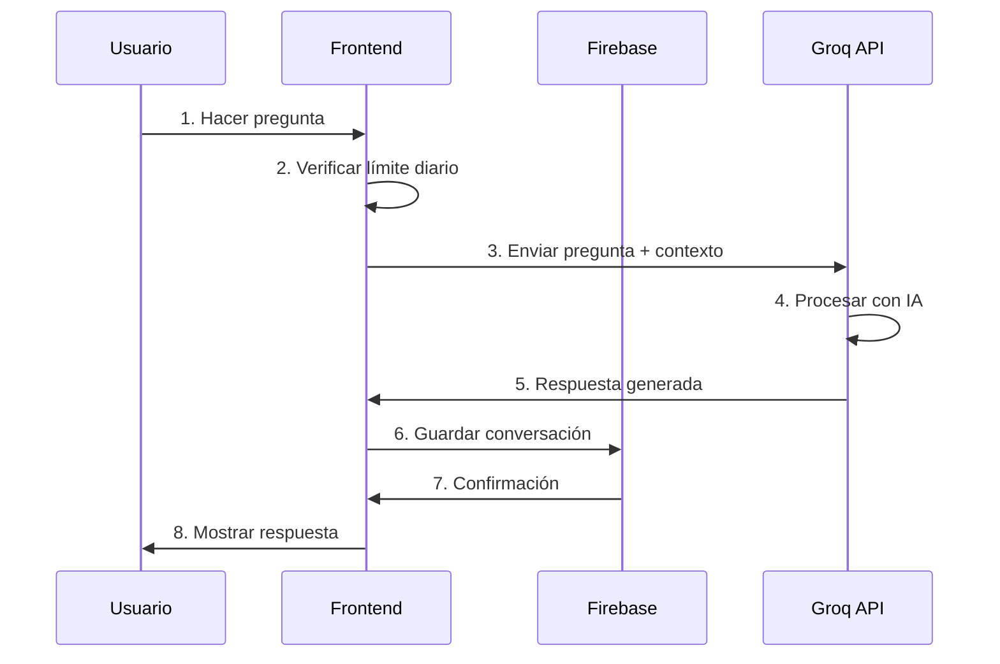

# 🎓 Luminom IA - Tutor Universitario Inteligente

**Tutor universitario con IA diseñado específicamente para estudiantes colombianos**

🔗 **Demo en vivo**: https://srdaniontop-netizen.github.io/luminam-ia/

[](https://srdaniontop-netizen.github.io/luminam-ia/)
[](LICENSE)
[](https://firebase.google.com/)
[](manifest.json)

---

## 📸 Screenshots

### 🏠 Página Principal

*Página principal con diseño elegante y llamada a la acción*

### 💬 Chat con IA

*Interfaz de chat con el tutor IA, historial y estadísticas*

### 📚 Generador de Planes de Estudio

*Formulario para generar planes de estudio personalizados*

### 👑 Panel de Administración

*Dashboard con estadísticas y gestión de usuarios*

### 🌙 Modo Oscuro

*Tema oscuro que invierte colores preservando el dorado*

> **Nota:** Reemplaza los placeholders con screenshots reales de tu aplicación

---

## 🏗️ Arquitectura del Sistema



### Flujo de Datos



---

## ✨ Características Principales

### Core Features
- 🎯 **Adaptado a ti**: Respuestas personalizadas según tu carrera
- ⚡ **Disponible 24/7**: A cualquier hora, sin esperas
- 📚 **50+ Materias**: Desde cálculo hasta derecho constitucional
- 💬 **Conversación natural**: Pregunta como hablarías con un compañero
- 🇨🇴 **Contexto colombiano**: Ejemplos locales y explicaciones claras

### New Features ✨
- 🌙 **Modo Oscuro**: Tema claro/oscuro con un click
- 📄 **Exportar a PDF**: Descarga tus conversaciones
- 🎤 **Entrada por Voz**: Habla en lugar de escribir
- 📱 **PWA**: Instalable como app en tu móvil
- 📊 **Estadísticas**: Tracking de preguntas y racha diaria
- 📎 **Subir Archivos**: Adjunta PDFs e imágenes para análisis
- 📚 **Planes de Estudio**: Generador IA de cronogramas personalizados

---

## 🚀 Stack Tecnológico (Full Stack)

### Frontend
- **HTML5**: Estructura semántica
- **CSS3**: Variables CSS, animaciones, grid/flexbox
- **JavaScript ES6+**: Async/await, modules, DOM manipulation

### Backend (BaaS)
- **Firebase Authentication**: Gestión de usuarios
- **Firestore**: Base de datos NoSQL en tiempo real
- **Security Rules**: Autorización a nivel de base de datos

### APIs Externas
- **Groq API**: Procesamiento de lenguaje natural (Llama 3.3 70B)
- **Wompi API**: Gateway de pagos colombiano
- **PDF.js**: Extracción de texto de documentos
- **Web Speech API**: Reconocimiento de voz

### DevOps
- **GitHub Pages**: Hosting frontend
- **Service Worker**: Caching y modo offline
- **PWA**: Progressive Web App
- **Git**: Control de versiones

---

## 🚀 Estructura del Proyecto

```
luminam-ia/
├── index.html              → Página principal (landing)
├── login.html              → Login y registro
├── tutor.html              → Chat con IA (requiere login)
├── admin.html              → Panel de administración
├── servicios.html          → Planes y precios
├── COMO_ACCEDER_ADMIN.md  → Guía del panel admin
└── README.md              → Este archivo
```

---

## 🚀 Cómo Usar

### Paso 1: Regístrate

1. Ve a **https://srdaniontop-netizen.github.io/luminam-ia/**
2. Haz clic en **"Comenzar gratis"** o **"Registrarse"**
3. Completa el formulario con:
   - Nombre completo
   - Email
   - Carrera universitaria
   - Contraseña
4. Haz clic en **"Crear cuenta"**

### Paso 2: Configura tu API Key (Gratis)

1. Ve a [https://console.groq.com](https://console.groq.com)
2. Crea una cuenta gratuita (sin tarjeta)
3. Ve a **API Keys** → **Create API Key**
4. Copia tu key (empieza con `gsk_...`)
5. Pégala cuando el tutor te la pida

### Paso 3: ¡Empieza a Aprender!

- Haz preguntas en lenguaje natural
- Selecciona temas rápidos (Cálculo, Programación, etc.)
- Recibe explicaciones paso a paso

---

## 🔐 Sistema de Autenticación

**IMPORTANTE**: Desde esta versión, el tutor requiere registro obligatorio.

### ¿Por qué registro obligatorio?

- ✅ **Historial personalizado**: Guardamos el contexto de tus conversaciones
- ✅ **Experiencia adaptada**: Las respuestas se ajustan a tu carrera
- ✅ **Seguimiento de progreso**: Pronto podrás ver tu evolución
- ✅ **Funciones premium**: Preparación para características futuras

### Datos almacenados:

```javascript
{
  nombre: "Juan Pérez",
  email: "juan@email.com",
  carrera: "Ingeniería de Sistemas",
  fechaRegistro: "2026-06-17",
  apiKey: "solo en tu navegador"
}
```

**Seguridad**:
- 🔒 Contraseñas en texto plano (demo - en producción usar bcrypt)
- 💾 Datos en localStorage (no hay servidor)
- 🔑 API Key solo en tu navegador

---

## 🔧 Panel de Administración

### Cómo Acceder

Simplemente ve a: **https://srdaniontop-netizen.github.io/luminam-ia/admin.html**

### Funcionalidades

- 📊 **Estadísticas**: Usuarios, conversaciones, actividad
- 👥 **Lista de usuarios**: Información de todos los registrados
- 📈 **Gráficos**: Carreras más populares, actividad diaria
- 📝 **Logs**: Historial de acciones (próximamente)

### Nota Importante

El panel admin actual muestra datos **demo/simulados** porque:
- No hay backend real
- Datos en localStorage del navegador
- Sin autenticación admin (cualquiera puede acceder)

**Para producción**, implementa:
- Backend con base de datos
- Autenticación de rol admin
- API REST para gestión de datos

[Ver guía completa →](./COMO_ACCEDER_ADMIN.md)

---

## 🎯 Páginas del Sitio

| Página | URL | Descripción | Requiere Login |
|--------|-----|-------------|----------------|
| **Inicio** | `/index.html` | Landing page con información | ❌ No |
| **Login/Registro** | `/login.html` | Autenticación de usuarios | ❌ No |
| **Tutor IA** | `/tutor.html` | Chat inteligente con IA | ✅ Sí |
| **Servicios** | `/servicios.html` | Planes y precios | ❌ No |
| **Admin** | `/admin.html` | Panel de administración | ❌ No (demo) |

---

## 🎨 Diseño y Tipografía

### Paleta de Colores

```css
--navy: #0A1628      /* Azul oscuro principal */
--gold: #C9A84C       /* Dorado elegante */
--off-white: #F8F6F1  /* Fondo suave */
```

### Tipografía

- **Display**: Playfair Display (serif elegante)
- **Body**: Inter (sans-serif moderna)

### Inspiración

Diseño profesional y académico, inspirado en universidades prestigiosas.

---

## 📦 Desplegar tu Propia Versión

### GitHub Pages (Recomendado - Gratis)

1. **Fork este repositorio**
2. **Settings** → **Pages**
3. **Source**: Deploy from a branch
4. **Branch**: `main` → **Folder**: `/root`
5. **Save**

Tu app estará en: `https://tu-usuario.github.io/luminam-ia/`

### Vercel (Alternativa)

1. Importa el repo en Vercel
2. Configura como Static Site
3. Deploy

---

## 🎨 Personalización

### Cambiar Colores

Edita las variables CSS en cualquier archivo HTML:

```css
:root {
  --primary: #6366F1;    /* Violeta */
  --secondary: #8B5CF6;  /* Púrpura */
  --accent: #EC4899;     /* Rosa */
  --darker: #020617;     /* Fondo oscuro */
}
```

### Cambiar el Modelo de IA

En `tutor.html`, cambia el modelo (línea ~406):

```javascript
const API_CONFIG = {
  url: 'https://api.groq.com/openai/v1/chat/completions',
  model: 'llama-3.3-70b-versatile'  // ← Cambia esto
};
```

Modelos disponibles en Groq (gratis):
- `llama-3.3-70b-versatile` (recomendado - más inteligente)
- `llama-3.1-8b-instant` (más rápido, menos preciso)
- `mixtral-8x7b-32768` (buen balance)

Ver todos: [https://console.groq.com/docs/models](https://console.groq.com/docs/models)

### Personalizar el Prompt

En `tutor.html`, busca `systemPrompt` y edita:

```javascript
const systemPrompt = `Eres [NOMBRE], un tutor que...`;
```

---

## 📊 Materias Soportadas

✅ **Matemáticas**: Cálculo, Álgebra, Estadística, Geometría  
✅ **Física**: Mecánica, Termodinámica, Óptica, Cuántica  
✅ **Programación**: Python, JavaScript, Java, C++, C#  
✅ **Química**: Orgánica, Inorgánica, Bioquímica  
✅ **Economía**: Microeconomía, Macroeconomía  
✅ **Derecho**: Constitucional, Civil, Penal  
✅ **Inglés**: Gramática, vocabulario, writing  
✅ **Y muchas más...**

---

## 🔒 Privacidad y Seguridad

### ¿Dónde se guarda mi API Key?

Tu API Key se guarda **solo en tu navegador** usando `localStorage`:
- ❌ **NO** se envía a ningún servidor nuestro (no tenemos servidor)
- ❌ **NO** se guarda en GitHub
- ✅ Solo se usa para llamadas directas a Groq API
- ✅ Puedes borrarla cuando quieras (botón "🔑 API Key")

### ¿Puedo compartir mi API Key?

**NO**. Tu API Key es personal. Si alguien la tiene, puede:
- Usar tu cuota de requests
- Potencialmente violar términos de servicio de Groq

**Para cambiar tu key:**
1. Haz clic en **"🔑 API Key"** en el tutor
2. Pega tu nueva key

---

## ⚡ Solución de Problemas

### "Por favor ingresa tu API Key"

**Causa**: No has configurado tu API Key de Groq.

**Solución**: 
1. Ve a [console.groq.com](https://console.groq.com)
2. Crea una cuenta y genera una API Key
3. Pégala en la app

### "Error 401: Invalid API Key"

**Causa**: Tu API Key es incorrecta o expiró.

**Solución**: 
1. Verifica que copiaste la key completa (empieza con `gsk_`)
2. Genera una nueva key en Groq
3. Haz clic en "🔑 API Key" y actualízala

### "Error 429: Rate Limit"

**Causa**: Excediste los límites del plan gratuito (30 req/min).

**Solución**: Espera 1 minuto y vuelve a intentar.

### Las respuestas son muy lentas

**Causa**: Groq está saturado o tu conexión es lenta.

**Solución**: 
- Intenta en otro momento
- Cambia a un modelo más rápido como `llama-3.1-8b-instant`

---

## 🚀 Roadmap

- [x] Chat básico con IA
- [x] Página de login (demo)
- [x] Página de servicios
- [x] Panel admin (demo)
- [ ] Historial de conversaciones (localStorage)
- [ ] Modo oscuro/claro
- [ ] Exportar conversaciones a PDF
- [ ] Múltiples modelos para elegir
- [ ] Reconocimiento de voz
- [ ] PWA (app instalable)
- [ ] Backend real con autenticación
- [ ] Sistema de pagos (Premium)

---

## 🤝 Contribuir

¿Quieres mejorar Luminom IA?

1. Fork el proyecto
2. Crea tu rama: `git checkout -b feature/mejora`
3. Commit: `git commit -m 'Add: nueva función'`
4. Push: `git push origin feature/mejora`
5. Abre un Pull Request

**Ideas de mejoras:**
- Temas personalizados (dark/light mode)
- Soporte para más idiomas
- Explicaciones con diagramas (Mermaid.js)
- Modo matemático con LaTeX
- Generador de flashcards
- Quizzes interactivos

---

## 🛠️ Tecnologías

- **Frontend**: HTML5, CSS3, JavaScript Vanilla (sin frameworks)
- **IA**: Groq API (Llama 3.3 70B)
- **Hosting**: GitHub Pages
- **Diseño**: Glassmorphism, gradientes, animaciones CSS
- **Arquitectura**: Static site (sin backend)

---

## 📄 Licencia

MIT License - Usa, modifica y distribuye libremente

---

## 🌟 Créditos

- **IA**: [Groq](https://groq.com) (API) + Meta (Llama 3.3)
- **Diseño**: Luminom IA Team
- **Inspiración**: Estudiantes colombianos 🇨🇴

---

## 💬 Contacto

- **GitHub**: [@srdaniontop-netizen](https://github.com/srdaniontop-netizen)
- **Proyecto**: [luminam-ia](https://github.com/srdaniontop-netizen/luminam-ia)
- **Issues**: [Reportar problema](https://github.com/srdaniontop-netizen/luminam-ia/issues)

---

## 📝 Notas Importantes

### Para Usuarios

- **Groq API es gratis** pero requiere registro (sin tarjeta)
- Tu API Key es **personal**, no la compartas
- La app **no tiene backend**, todo es frontend
- Los datos se guardan **solo en tu navegador**

### Para Desarrolladores

- Código 100% cliente (HTML/CSS/JS)
- Sin dependencias externas (no npm, no build)
- Diseño responsive (mobile-first)
- Accesible (puede mejorarse con ARIA labels)

---

**Hecho con ❤️ para estudiantes colombianos — 100% gratis**

🔗 **Pruébalo ahora**: https://srdaniontop-netizen.github.io/luminam-ia/

📚 **¿Necesitas ayuda?** Abre un [issue en GitHub](https://github.com/srdaniontop-netizen/luminam-ia/issues)
